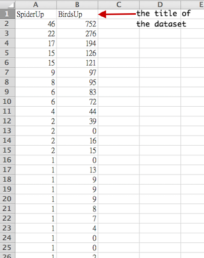
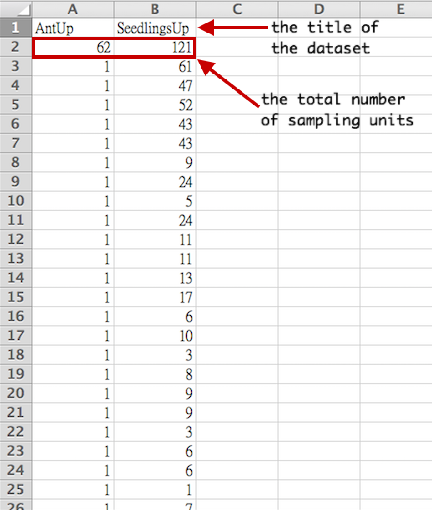

<script>
  (function(i,s,o,g,r,a,m){i['GoogleAnalyticsObject']=r;i[r]=i[r]||function(){
  (i[r].q=i[r].q||[]).push(arguments)},i[r].l=1*new Date();a=s.createElement(o),
  m=s.getElementsByTagName(o)[0];a.async=1;a.src=g;m.parentNode.insertBefore(a,m)
  })(window,document,'script','//www.google-analytics.com/analytics.js','ga');

  ga('create', 'UA-46391490-4', 'rstudio.com');
  ga('send', 'pageview');

</script>

User Guide
================
<font size="3">
* [Overview](#overview)
  * [How to Cite](#cite)
* [Data Settings](#data-settings)
  * [Data Type](#type)
  * [Dataset](#dataset)
  * [Import Data](#import)
  * [Upload Data](#upload)
* [General Settings](#gen-settings)
  * [Estimator](#estimator)
  * [Bootstraps](#bootstraps)
  * [Confidence level](#confidence)
* [Output](#output)
  * [Data Summary](#summary)
  * [Esitmation](#chaoentropy)
  * [Visualization](#vis)
* [References](#reference)

* * * * * * * *

<h2 id="overview">Overview</h2>
The program **ChaoEntropy** (Shannon **entropy** proposed by **Chao** et al.) online is written in the <a href="http://www.r-project.org/" target="_blank">R</a> language and the interactive web application is built by using <a href="http://www.rstudio.com/shiny" target="_blank">Shiny</a>. The user provides a vector of abundances of individual species (abundance data) or incidences of individual species (incidence data). **ChaoEntropy** computes the Shannon entropy estimators, bootstrap standard error and confidence intervals.

_<h3 id="cite">How to Cite</h3>_
<font color="ff0000">If you use **ChaoEntropy** to obtain results for publication, you should cite the papers (Chao, A., Wang, Y. T. and Jost, L. (2013) Entropy and the species accumulation curve: a novel entropy estimator via discovery rates of new species. _Methods in Ecology and Evolution_, __4__, 1091-1100.) along with the following reference for ChaoEntropy:

<p style="padding-left: 30px;"> Chao, A., Lee, Y.-H. and Tseng, K.-S. (2014). ChaoEntropy online.</font>
  
To help refine **ChaoEntropy**, your comments or feedbacks would be welcome (please send them to chao@stat.nthu.edu.tw).

<h2 id="data-settings">Data Settings</h2>
_<h3 id="type">Data Type</h3>_
**ChaoEntropy** supports two types of data for computation the Shannon entropy:
1. Abundance data: a vector of abundances of individual species in the sample.
2. Incidence data: a vector of incidences of individual species in the sample (i.e., the number of sampling units that a species is found). 
User should select one of the data types to obtain output. Not only the data format but also the statistical method for the two data types are different. Please make sure you select the correct data type.

_<h3 id="dataset">Dataset</h3>_
Some demonstration datasets are used for illustration. 
* Abundance data: tropical foliage insects data in two sites: Oldgrowth and Secondgrowth (Janzen 1973a, b)
* Incidence data: tropical rain forest ants data by three collecting methods: Berlese, Malaise and fogging (Longino et al. 2002)
We suggest that you first run these demo datasets and try to understand the output before you import your own data sets. 
All the titles of the demo data and imported data (see [Import Data](#import) for details) are listed in this list box. You can choose a single dataset or multiple datasets for comparisons. 

_<h3 id="import">Import Data</h3>_
**ChaoEntropy** provides a visualized import data function. After checking the checkbox: **Import data**, user can input data (line by line) in the text area; the title of your imported data will be listed in the box: **Select dataset**. The import formats for the abundance data and incidence data are different. The data formats for the two types of data are described below.
* Import abundance data: 
We use a simple example to show how to import abundance data. Consider the spider data and the birds data (spider data is provided by Sackett et al. (2011); birds data is provided by Magurran, A. E. (1988))

  ```{r}
  Spider 46 22 17 15 15  9  8  6  6  4  2  2  2  2  1  1  1  1  1  1  1  1  1  1  1  1  
  Birds 752 276 194 126 121 97  95  83  72  44  39  0  16  15  0  13  9  9  9  8  7  4  0  0  2  2  1  1  1
  ```

Since there are two datasets, the imported data contain two lines (separated by return). The first line includes the species abundances for 26 species in the Spider and the second line includes the species abundances for 25 species in the Birds. **For each line, the first entry is the title of the dataset (the title is not allowed to start with a numerical digit) followed by the species abundances.** All entries should be separated by blank space (" "). For example, in the Spider, the most abundant species is represented by 46 individuals, the second most abundant species is represented by 22 individuals in the sample, etc. Although the species abundances in this example are entered in a decreasing order, the ordering is not relevant in our analysis. You can choose any ordering of species abundances. 

* Import incidence data:
  We use the ant data and the seedlings data (ant data is provided by Longino et al. (2002); seedlings data is provided by Colwell and Coddington (1994)) as an example:
  
  ```{r}
  Ant 62  1  1  1  1  1  1  1  1  1  1  1  1  1  1  1  1  1  1  1  1  1  1  1  1  1  1  1  1  1  1  1  1  1  1  1  1  1  1  1  2  2  2  2  2  2  2  2  2  2  2  2  2  2  2  2  2  2  3  3  3  3  3  3  3  3  3  3  3  3  3  4  4  4  4  4  4  4  5  5  5  5  6  6  7  9  9  9  9 10 10 12 13 14 14 14 15 15 16 18 19 19 20 29
  Seedlings 121  61  47  52  43  43   9  24   5  24  11  11  13  17   6  10   3   8   9   9  3   6   6   1   7   4   6   6   4   3   4   2   2   1   1
  ```

The import data contain two lines (separated by return), the first line includes ant data , and the second line includes seedlings data. **For each line, the first entry is the title of the dataset (the title is not allowed to start with a numerical digit), the second entry is the total number of sampling units, followed by the species incidences abundances (the number of sampling units that each species is found).** All element entries should be separated by blank space (" "). For example, ant data, 62 sampling units were used. The most frequent species was found in 29 sampling units, the second most frequent species was found in 20 units, etc. Although the species incidences in this example are entered in a decreasing order, the ordering is not relevant in our analysis.

_<h3 id="upload">Upload Data</h3>_
**ChaoEntropy** also provides a upload function. After click the **Upload data** button, there will show the **file choose** button to upload the data. **User's data MUST be .csv**. After upload the data, the title of your uploaded data will be listed in the box: **Select dataset**. The upload formats for the abundance data and incidence data are different. The data formats for the two types of data are described below.

* Upload abundance data: 
**In the file, each column represents a data, and the first entry is the title of the dataset (the title is not allowed to start with a numerical digit) followed by the species abundances.**



<a href="https://www.dropbox.com/s/rkkegvo4hyjak1u/abundance.csv" download>Download abundance demo file</a>

* Upload incidence data:
**In the file, each column also represents a data, and the first entry is the title of the dataset (the title is not allowed to start with a numerical digit), the second entry is the total number of sampling units, followed by the species incidences abundances (the number of sampling units that each species is found).**



<a href="https://www.dropbox.com/s/yyu8h806346kfsm/incidence.csv" download>Download incidence demo file</a>

<h2 id="gen-settings">General settings</h2>
_<h3 id="estimator">Estimator</h3>_
The estimator is a checkbox for select the method which constructed to estimate Shannon entropy.
  * __Chao__ estimator, for detail see reference 1.
  * __ChaoShen__ estimator, for detail see reference 3.
  * __Grassberger__ estimator, for detail see reference 4.
  * __Jackknife__ estimator, for detail see reference 5.
  * __Zhang__ estimator, for detail see reference 6.
  * __Observed__ estimator.

_<h3 id="bootstraps">Bootstraps</h3>_
Number of bootstraps (say B) is an integer specifying the number of replications for bootstrap resampling scheme in computing variance. Refer to Chao et al. (2013) for details. Default is 100. To save running time, we recommend that 100 or 200 bootstraps will be sufficient for most applications.  

_<h3 id="confidence">Confidence level</h3>_
The confidence level is a positive number is less than or equal to 1. The default is 0.95.

<h2 id="output">Output</h2>
_<h3 id="summary">Data Summary</h3>_
This tab panel shows basic data information for the selected data. The output variables are interpreted at the first column.

_<h3 id="chaoentropy">Estimation</h3>_
This tab panel shows the main output for **ChaoEntropy**. It show a table of various Shannon entropy estimators, their standard error and confidence interval which the method you choose. You also can click [Download as csv file]() to download the output table.

_<h3 id="vis">Visualization</h3>_
This tab panel shows the interactive estimator and confidence interval plot.

<h2 id="reference">References</h2>
1. Chao, A., Wang, Y. T. and Jost, L. (2013) Entropy and the species accumulation curve: a novel entropy estimator via discovery rates of new species. _Methods in Ecology and Evolution_, __4__, 1091-1100.

2. Chao, A. & Jost, L. (2012) Coverage-based rarefaction and extrapolation: standardizing samples by completeness rather than size. _Ecology_, __93__, 2533-2547.

3. Chao, A. & Shen, T.J. (2003) Nonparametric estimation of Shannon's index of diversity when there are unseen species. _Environmental and Ecological Statistics_, __10__, 429-443.

4. Grassberger, P. (2003) Entropy estimates from insufficient samplings. <a href="http://www.arxiv.org/" target="_blank">URL</a>. arXiv:physics/0307138v2. Updated 2008.

5. Zahl, S. (1977) Jackknifing an index of diversity. _Ecology_, __58__, 907-913.

6. Zhang, Z. (2012) Entropy estimation in Turing's perspective. _Neural Computation_, __24__, 1368-1389.

7. Chao, A. (1984) Nonparametric estimation of the number of classes in a population. _Scandinavian Journal of Statistics_, __11__, 265-270.

8. Chao, A. (1987) Estimating the population size for capture-recapture data with unequal catchability. _Biometrics_, __43__, 783-791.
</font>